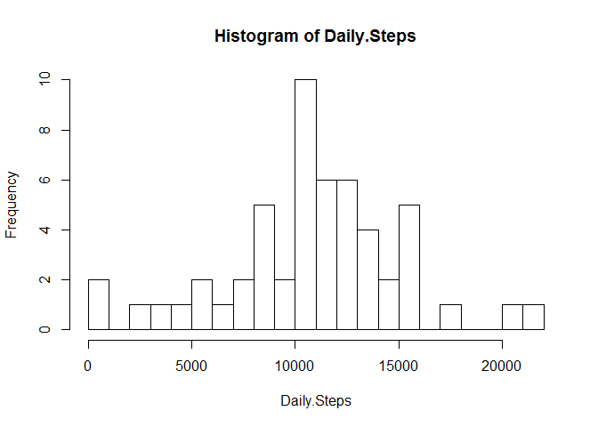
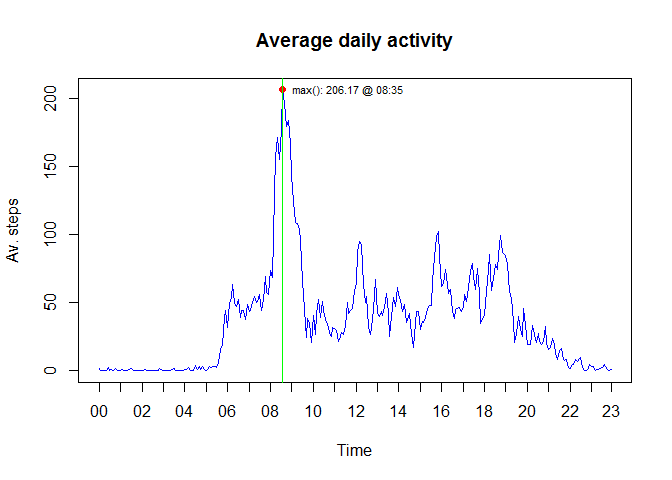
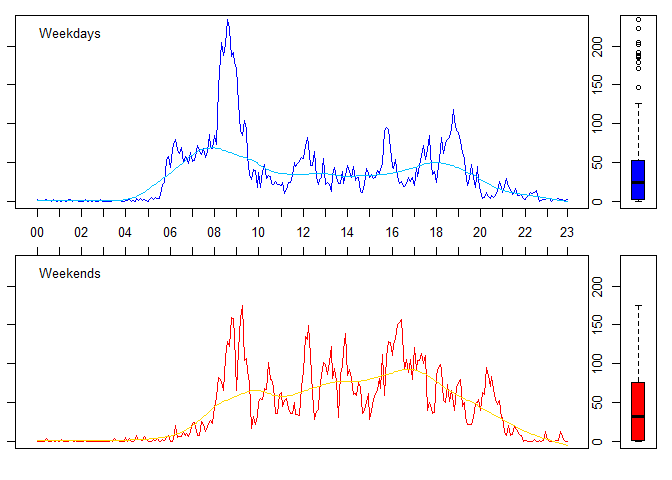

# Coursera Knitr assignment - Activity monitoring

###Loading and preprocessing the data
Here we are just loading the file, giving intervals easier to understand format and creating the second dataset without NAs to avoid puttin *na.rm=TRUE* in many places :)

```r
#function to convert 5-min intervals to better human-readable version
par(mfrow=c(1,1))
interval_to_time <- function(interval)
        {
        zero_num=4-nchar(paste(interval))
        zeroes <- paste0(rep("0",zero_num),collapse="")
        time <- paste0(zeroes,interval)
        time <- paste0(substr(time,1,2),":",substr(time,3,4))
        time
        }
#loading the file
activity <- read.csv("activity.csv")
activity$interval_txt <- as.factor(sapply(activity$interval,interval_to_time))
activity$date <- as.Date(activity$date,"%Y-%m-%d")
#creating data set without NAs
activity_na_rm <- na.omit(activity)
```

###What is mean total number of steps taken per day?
Here is the histogram of the daily steps totals

```r
Daily.Steps <- tapply(activity_na_rm$steps,activity_na_rm$date,sum)
hist(Daily.Steps,breaks=20 )
```

<!-- -->

###Calculating median & mean of total number of steps

```r
median_Steps <- median(Daily.Steps)
mean_Steps <- mean(Daily.Steps)
```
The code above gives us the median = **10765** and Mean = **10766.19**

###What is the average daily activity pattern?
Average daily activity is created using the code below. Maximum value and time is highlighted on the graph.

```r
min5 <- tapply(activity_na_rm$steps,activity_na_rm$interval_txt,mean)
plot(min5,type="l",col="blue",xaxt="n",xlab="Time",ylab="Av. steps", main="Average daily activity")

#human readable per-hour x-axis
y_axis <- c(seq(1,288,12),288)
axis(1,at=y_axis,labels=substr(names(min5[y_axis]),1,2))

#printing max value and position
max_index <- which.max(min5)
max_val <- max(min5)
points(max_index,max_val,col="red",pch=16)
text(max_index, max_val, labels=paste("max():",round(max_val,digits=2),"@",names(min5[max_index])), cex= 0.7, pos=4)
abline(v=max_index,col="green")
```

<!-- -->
From the graph above we can see that the average maximum daily activity corresponds to the 5-min period that starts at **08:35** and equals **206.17** steps.


###Imputing missing values


```r
NAs <- sum(!complete.cases(activity))
```
Gives us a total of **2304** missing values

We're replacing missing values with averages for corresponding averages for 5-min intervals (should be a bit more accurate than the same with daily averages)

```r
#making a copy
activity_impute <- activity
#replacing NAs with 5-min averages
na_index <- is.na(activity_impute$steps)
activity_impute$steps[na_index] = min5[activity_impute$interval_txt[na_index]]
```

The new histogram is slightly different ()


```r
Daily.Steps_imp <- tapply(activity_impute$steps,activity_impute$date,sum)
hist(Daily.Steps_imp,breaks = 20)
```

<!-- -->

```r
median_steps_imp <- median(Daily.Steps_imp)
mean_steps_imp <- mean(Daily.Steps_imp)
```

Let's recalculate mean and median values:  
Median = **10766.19**  
Mean = **10766.19**

Median stayed the same, which was expected, however the mean has changed and now equals the median.

###Are there differences in activity patterns between weekdays and weekends?
For this part 2 assumptions were made:  
1. I assumed weekend days are Saturday and Sunday (which may differ from country to country).
Since they both starts with capital "S" that makes filtering them quite easy  
2. I also assume we are using non-imputed data-set, overwise 5-minute interval averages 
for omitted data would mix weekend & weekday statistics a little bit

```r
weekends_index <- grep("^S",weekdays(activity_na_rm$date))     
weekdays_index <- grep("^[^S]",weekdays(activity_na_rm$date)) 

activity_weekends <- activity_na_rm[weekends_index,]
activity_weekdays <- activity_na_rm[weekdays_index,]

min5_weekends <- tapply(activity_weekends$steps,activity_weekends$interval_txt,mean)
min5_weekdays <- tapply(activity_weekdays$steps,activity_weekdays$interval_txt,mean)

par(mfrow=c(2,2),mar=c(2,1,1,1))

#boxplot_l_y
par(fig=c(0.9,1,0.0,0.5))
boxplot(min5_weekends,ylim=c(0,230),col="red",mar=c(0,0,0,0))
#plot_l
par(fig=c(0,0.9,0.0,0.5),new=TRUE)
plot(min5_weekends,xaxt="n",type="l",col="red",ylim=c(0,230))
lines(lowess(min5_weekends,f=1/5,iter=2), col="gold")
axis(3,at=y_axis,labels=FALSE)
legend(x="topleft","Weekends",bty="n")
#boxplot_u_y
par(fig=c(0.9,1,0.5,1),new=TRUE)
boxplot(min5_weekdays,ylim=c(0,230),col="blue")

#plot_u
par(fig=c(0,0.9,0.5,1),new=TRUE)
plot(min5_weekdays,xaxt="n",type="l",col="blue",ylim=c(0,230))
lines(lowess(min5_weekdays,f=1/5,iter=2), col="deepskyblue")
axis(1,at=y_axis,labels=substr(names(min5[y_axis]),1,2))
legend(x="topleft",legend="Weekdays",bty="n")
```

<!-- -->

**Conclusions:**
Well, the test subject definitely wakes up later and is more active during the day on weekends.
The morning spike on weekdays probably can be attributed either to a long walk during the commute or some fitness activity (i.e. jogging) **:)**  
